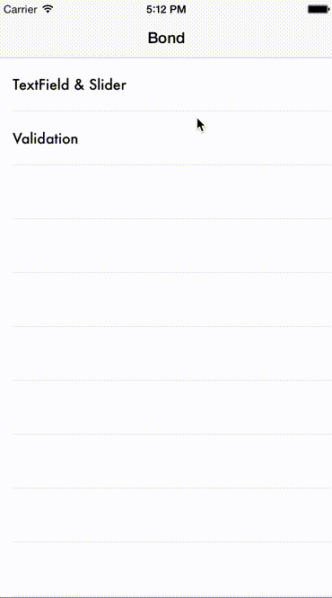
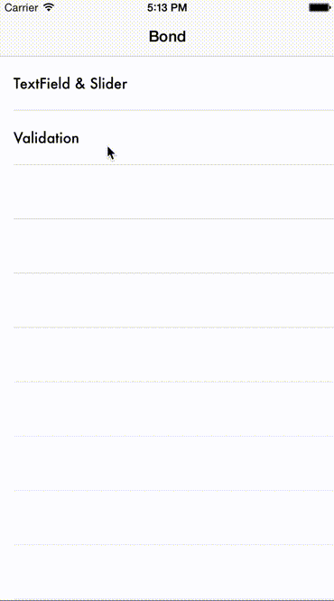

SwiftBond/Bond Demo
=====

UITextField and UISlider
---

### About



### Code

```swift
override func viewDidLoad() {
    super.viewDidLoad()

    // UITextField
    textField ->> textLabel

    // UISlider
    slider
        .designatedDynamic()
        .map({"Hi, my value is \($0)"})
        ->> sliderLabel
}
```

Validation
---

### About

This is the common example of validating a signup form.

- rule1: you are able to push the button, to satisfy the follwing conditions. 
    1. username and email are not empty.
    2. password and password confirmation are equal.
    3. password length is more than 8 characters.
- rule2: if password and password confirmation are different, output error message.



### Code

```swift
override func viewDidLoad() {
    super.viewDidLoad()

    // designate dynamic
    let username = usernameField.designatedDynamic()
    let email = usernameField.designatedDynamic()
    let password = passwordField.designatedDynamic()
    let passwordConfirm = passwordConfirmField.designatedDynamic()

    // ============= rule1 =============
    let rule1a = reduce(username, email, false) { !($0.isEmpty || $1.isEmpty) }
    let rule1b = reduce(password, passwordConfirm, false) { $0 == $1 }
    let rule1c = password.map { countElements($0) >= 8 }
    reduce(rule1a, rule1b, rule1c, false) { $0 && $1 && $2 } ->> createButton

    // ============= rule2 =============
    reduce(password, passwordConfirm, "") {
        $0 == $1 ? "" : "The password does not match"
    } ->> errorLabel

}
```

Getting Started
-----

`git clone https://github.com/mpon/SwiftBondDemo.git`

`git submodule update --init`

`open SwiftBondDemo.xcodeproj`

